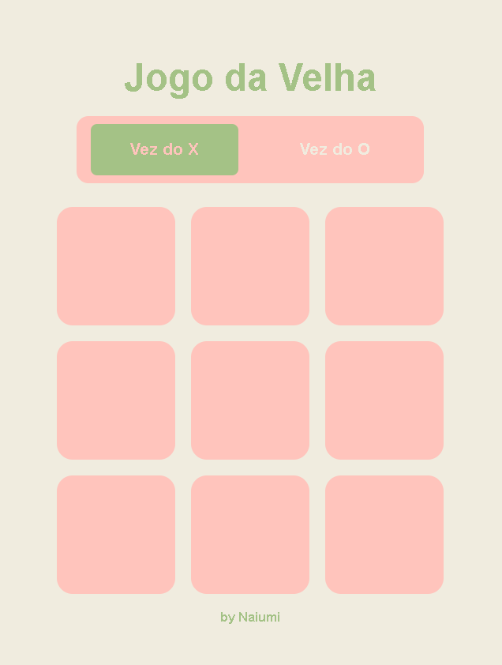

# Jogo da Velha

Um jogo da velha simples desenvolvido com HTML, CSS e JavaScript.

## Funcionalidades Principais:

- **Interface Intuitiva:** Design limpo e fácil de usar.
- **Escolha do Jogador:** Permite escolher jogar com "X" ou "O".
- **Lógica do Jogo:** Detecta automaticamente o vencedor ou empate.
- **Reiniciar Jogo:** Botão para reiniciar a partida a qualquer momento.
- **Responsividade:** Layout adaptável para diferentes tamanhos de tela.

## Tecnologias Utilizadas:

- **HTML:** Estrutura da página web.
- **CSS:** Estilização da interface.
- **JavaScript:** Lógica do jogo e interatividade.

## Por que este projeto?

Este projeto foi desenvolvido como um exercício prático para:

- **Aprendizado:** Aprofundar meus conhecimentos em JavaScript, HTML e CSS.
- **Lógica de Jogo:** Implementar a lógica de um jogo simples.
- **Interatividade:** Criar uma experiência interativa para o usuário.

## Como Jogar:

1. Clique no link: https://jogo-da-velha-mu-ten.vercel.app/
2. Escolha se deseja jogar com "X" ou "O".
3. Clique nas células do tabuleiro para fazer sua jogada.
4. O jogo detectará automaticamente o vencedor ou empate.
5. Clique em "Reiniciar Jogo" para jogar novamente.

## Referências:

- Inspirado em jogos clássicos de Jogo da Velha.
- Layout inspirado no https://github.com/resolvendobug/jogo-da-velha

## Autor:

- Naiumi Paiva
